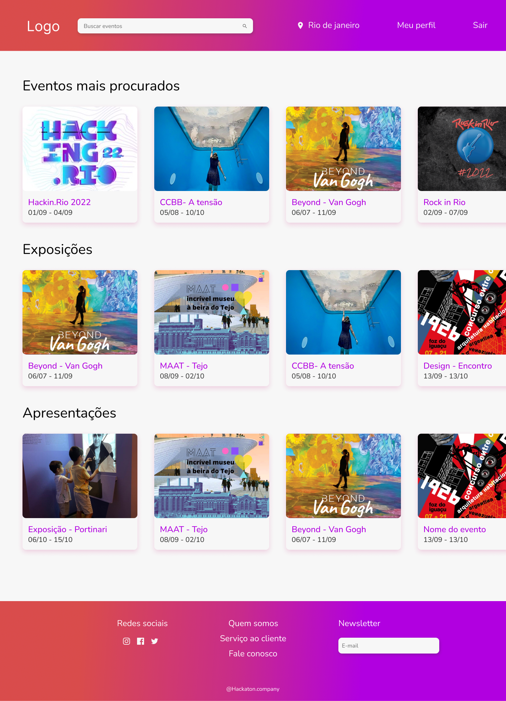

# Hacking.Rio 2022 👩🏻‍💻
## Equipe 19 - Goofy A 🤡  

### 📌 Projeto Educa Verso - ODS 4 Educação de qualidade, desafio SEBRAE

Somos cinco entusiastas da tecnologia que aceitamos o desafio de trabalhar a educação no metaverso. Todos do grupo tem um pézinho na educação, seja como educador ou em empresas da área, mas sempre como alunos! Então pensamos: educação e tecnologia? É com a gente mesmo!

Assim criamos o EducaVerso, uma plataforma que reune as melhores e mais recentes tecnologias a fim de propor um meio de trabalhar a educação no metaverso. Nossa proposta é ir além do ensino tradicional!

## Educa Verso 2022

### 📌 O Projeto

Imagine poder realizar aulas imersivas e interativas no metaverso, exposições, palestras e todo tipo de conteúdo. Até renderizar objetos, interagir em tempo real com as pessoas e ainda testar os conteúdos aprendidos. Promover recompensas aos melhores colocados, sorteios ou NFTs com blockchain. Essa é a nossa ideia.

Mesclamos o metaverso e a blockchain com uma plataforma que serve como um serviço de gerenciamento de eventos que podem ser desde exposições de arte imersivas, até aulas tradicionais com turmas, aqui tudo é valido. Registre seu evento, defina desafios, crie sua sala no metaverso e selecione ou não recompensas em nfts, sorteie ingressos, descontos ou qualquer outro tipo de premiação!

Podemos ter diversos eventos simultaneos, cada um com ou sem um patrocinador, com ou sem recompensas, porém todos dentro do metaverso através de propostas educacionais em diversas áreas: cultura, arte, ensino tradicional, palestras, aulão... Então em um evento visualizamos seus desafios propostos (quiz, teste ou qualquer outra forma de avaliação de conteúdo) E podemos ir para o metaverso desse evento
 | 
:---------------:|:----------------:|

### 📌 Dentro do metaverso

Aqui podemos projetar qualquer coisa em primeira ou terceira pessoa, como uma maravilhosa exposição imersiva as artes de Van Gogh, utilizando objetos 3D como esculturas ou até uma incrivel imersão no Quarto em Arles, uma de suas obras mais famosas! Confire na gif abaixo

 | 
:---------------:|:----------------:|

## 📌 Acesse  

- [Plataforma](https://codebbsitter.github.io/hackingrio-page/#/)
- [Figma](https://www.figma.com/file/fNZXMfKdh0DSnXpyfM3Dd2/Hackaton-2022?node-id=75%3A39)
- [Whimscal](https://whimsical.com/hackaton-2022-F5fBA3t2P2FR7Lf282FzGD)
- [Documentação API](https://hackingrio-equipe19.herokuapp.com/docs/#/)
- [Exposição Teste](https://spatial.io/s/SEBRAE-Exposicao-Van-Gogh-6313669debd6c80001d71a50?share=532472515839314492)
- [Video apresentação](https://youtu.be/Tbo0yhICB-E)
- [OpenSea NFTs](https://testnets.opensea.io/collection/hackingbadge-on34anhqmw)

### 📌 Na nossa plataforma

Cadastre e patrocine eventos, crie medalhas em NFT como recompensa de participação, realize sorteio para os, interaja e principalmente, eduque!

 |  | io
:---------------:|:----------------:|:----------------:

## 💻 Tech
#### Back-end
  - NestJS
  - Postgres
  - TypeORM
  - JWT
### Web
  - Flutter
### Design
  - Figma
  - Whimscal
  - Design system
  - Material Icons
  - UI Faces
  - Google Fonts
### Blockchain
  - HardHat
  - Alchemy
  - Ethers
  - Pinata
  - ERC721
  - Open Zeppelin
### Metaverso
  - Spatial.io
### Banco de Dados

## Equipe Goofy A 🤡

 |  |  |  | 
:---------------:|:----------------:|:----------------:|:----------------:|:----------------:
